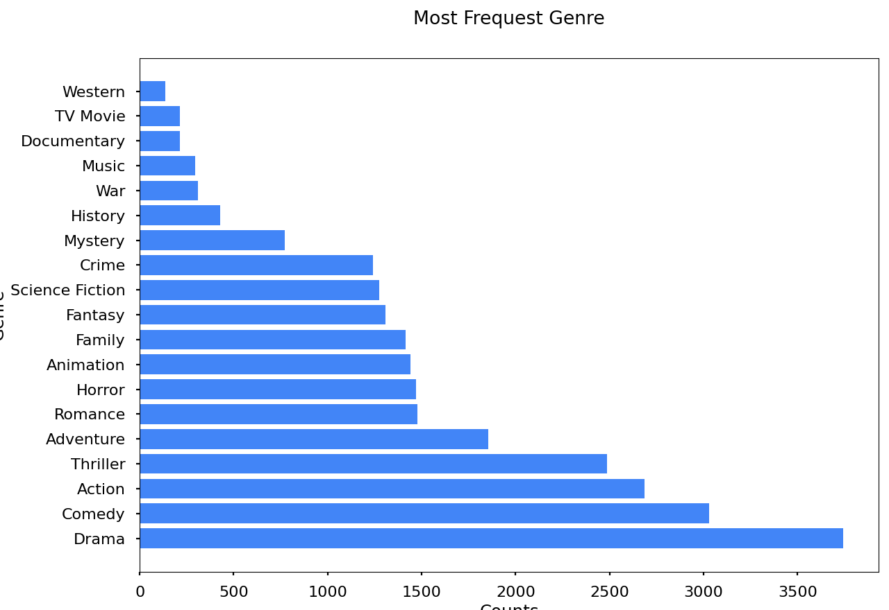
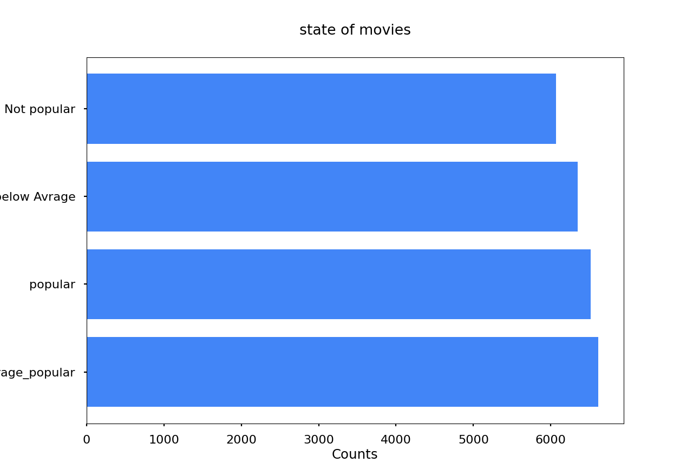
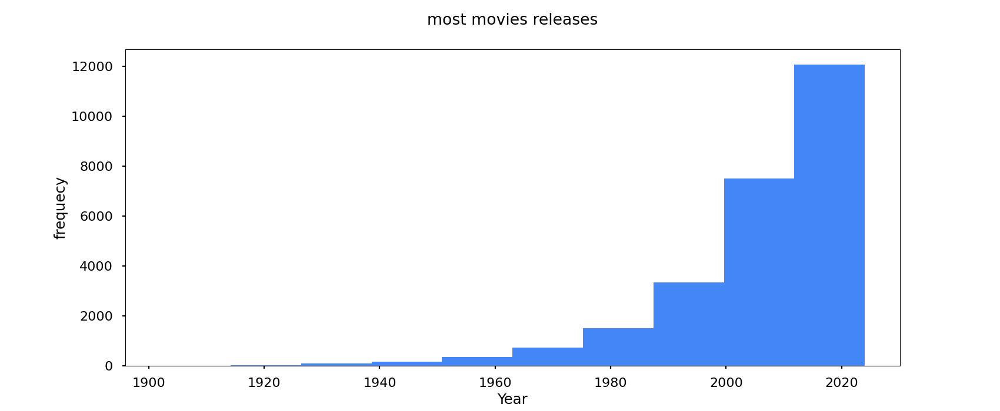

<!-- # netflix-data-analysis
### Visualization 
## 1. Most frequent genre 
</img>

## 2.  State of Movies

## 3. Most movies relse

## 4. Most famous Movies 
<h4>Spider-Man: No Way Home</h4>

Popularity: 5083.954

Vote_Count: 8940

Vote_Average: Popular

genre :Actoin

## 5. Most lowest Movies 
<h4>The United States vs. Billie Holiday</h4>

Popularity:13.45

Vote_Count: 152

Vote_Average: Avg_Popular

genre: Music/drama
 -->
# Netflix Data Analysis

## 📊 Visualizations

### 1. Most Frequent Genre

### 2. State of Movies

### 3. Most Movies Released

---

## 🎬 Top Movies Analysis

### Most Famous Movie

**Spider-Man: No Way Home**
- Popularity: 5083.954
- Vote Count: 8,940
- Vote Average: Popular
- Genre: Action

---

### Lowest Rated Movie

**The United States vs. Billie Holiday**
- Popularity: 13.45
- Vote Count: 152
- Vote Average: Avg Popular
- Genre: Music / Drama